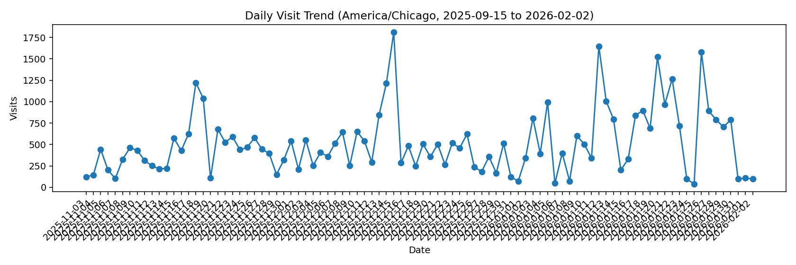
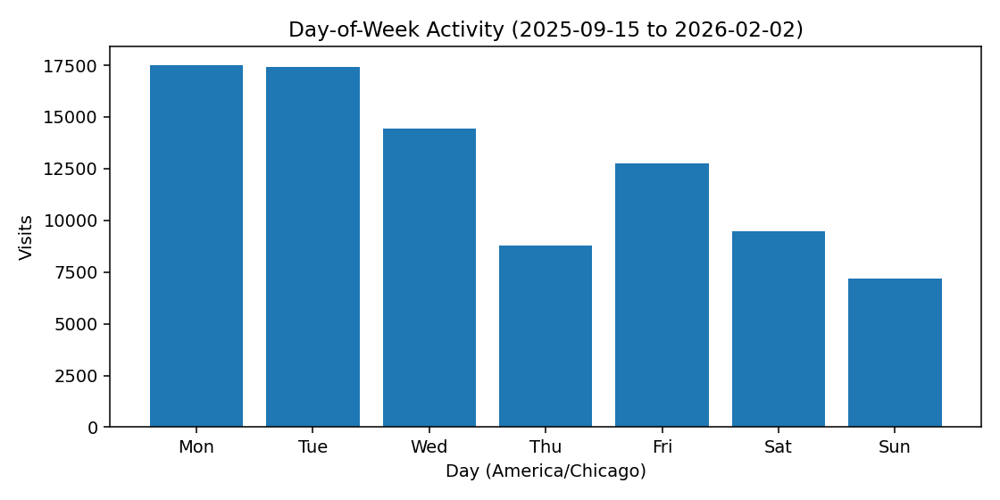
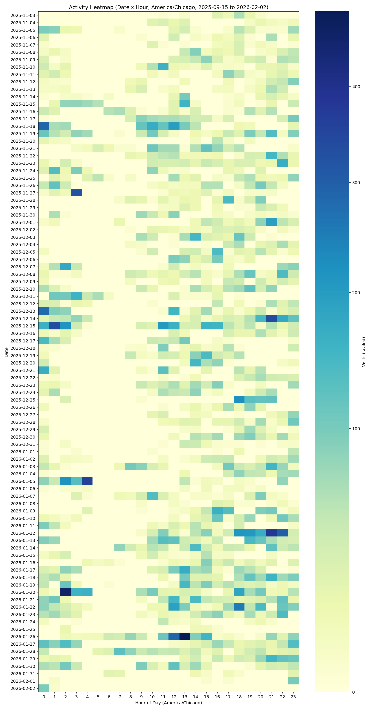

# Vivaldi History Exporter

Exports Vivaldi (Chromium) history into daily JSON files plus aggregate views for analysis and LLM input.

## Example Graphs
Example Heatmap, Daily Trend, and Weekday Output Output:




## Requirements
- Python 3.8+
- matplotlib (`pip install matplotlib`)
- Vivaldi or Chrome history DB at:
  - Vivaldi: `/mnt/c/Users/lucas/AppData/Local/Vivaldi/User Data/Default/History`
  - Chrome: `/mnt/c/Users/lucas/AppData/Local/Google/Chrome/User Data/Default/History`

## Usage

`source ./venv/bin/activate.fish`

```bash
python3 export_vivaldi_history.py --weeks 3 --browser vivaldi --output-dir timeline_data
python3 export_vivaldi_history.py --weeks 3 --browser chrome --output-dir timeline_data
```

Optional arguments:
- `--weeks`: number of weeks to export (default: 3)
- `--output-dir`: output directory for JSON files (default: `timeline_data`)
- `--browser`: choose default browser profile (`vivaldi` or `chrome`, default: `vivaldi`)
- `--db-path`: override the History DB path (takes precedence over `--browser`)

## Output Structure
```
timeline_data/
├── vivaldi/
│   ├── daily/
│   │   ├── history_YYYY-MM-DD.json
│   │   └── ...
│   ├── aggregate_3weeks.json
│   └── llm_input.json
├── chrome/
│   ├── daily/
│   │   ├── history_YYYY-MM-DD.json
│   │   └── ...
│   ├── aggregate_3weeks.json
│   └── llm_input.json
└── merge/
    ├── daily/
    │   ├── history_YYYY-MM-DD.json
    │   └── ...
    ├── aggregate_merged.json
    └── llm_input.json
```

## Notes
- The script copies the History database to `/tmp/History_copy` before querying to avoid locks.
- Chrome timestamps are converted to ISO 8601 (UTC, `Z` suffix).
- Transition types are decoded from the Chromium visit transition bitmask.
- Search queries are extracted for common engines (Google, Bing, DuckDuckGo, Yahoo, Brave).

## Merge Script
```bash
python3 merge_timeline_data.py --base-dir timeline_data
```

Merging rules:
- Daily merged visits include a `source` field (e.g., `vivaldi` or `chrome`).
- Aggregate/LLM merged summaries do not track per-URL sources.

## Chart Script
```bash
python3 plot_timeline_data.py --base-dir timeline_data --source merge
```

Outputs charts to `timeline_data/<source>/charts`:
- `top_domains.png`
- `top_urls.png`
- `hourly.png`
- `weekday.png`
- `top_search_queries.png`
- `heatmap.png`
- `daily_trend.png`
- `daily_unique_urls.png`
- `source_share.png`

## Example Images (Repo Root)
Example Heatmap Output:



## Run Script
```bash
bash run.sh
```

Timezone note:
- Charts use America/Chicago for hour/day bucketing.
